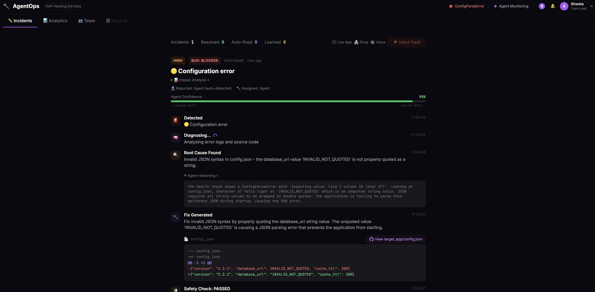
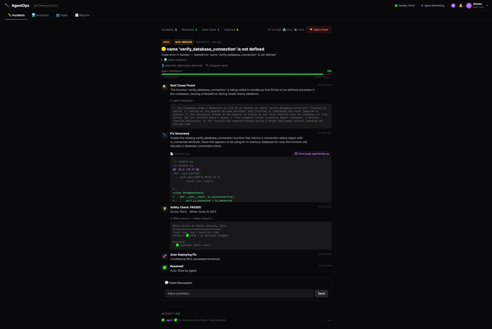
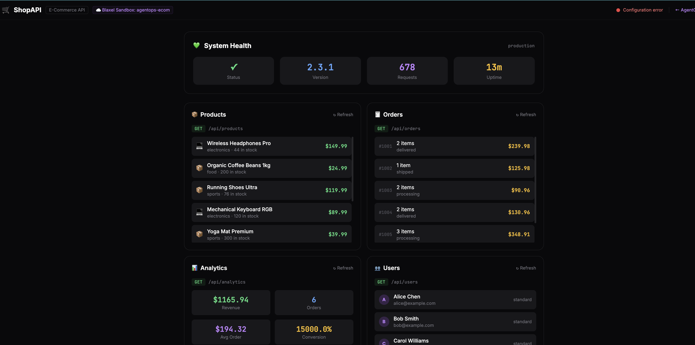
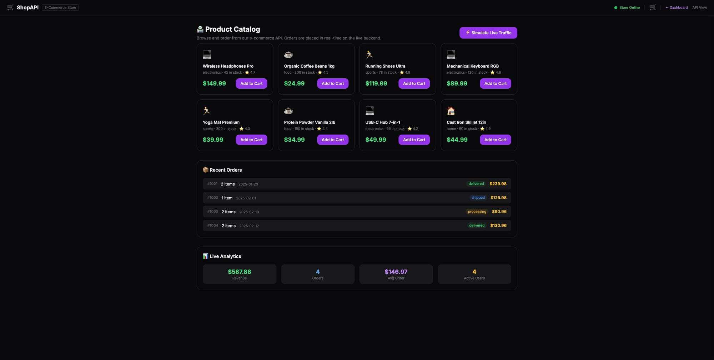
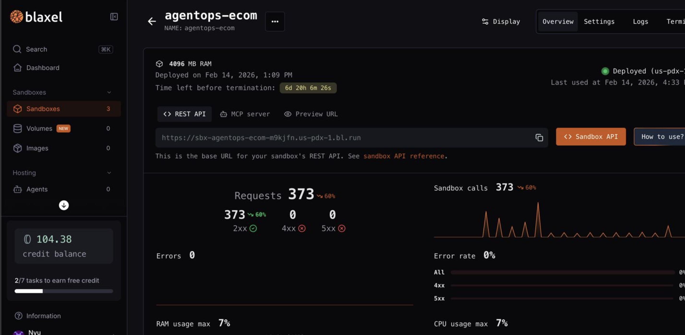
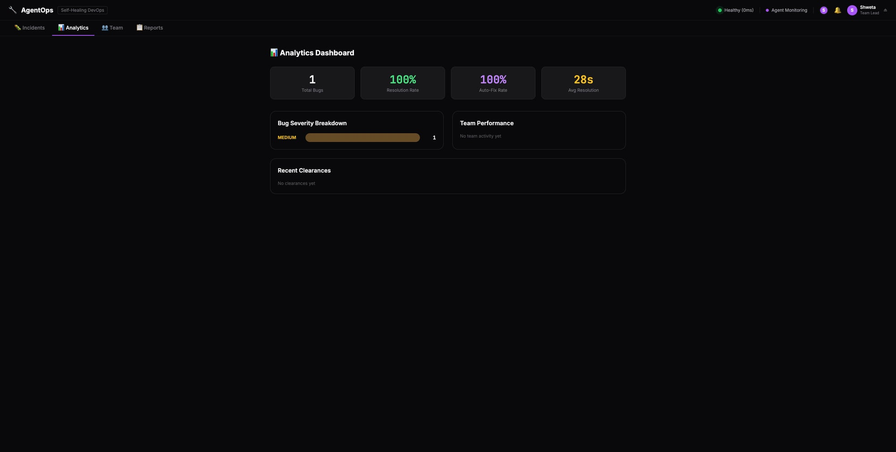
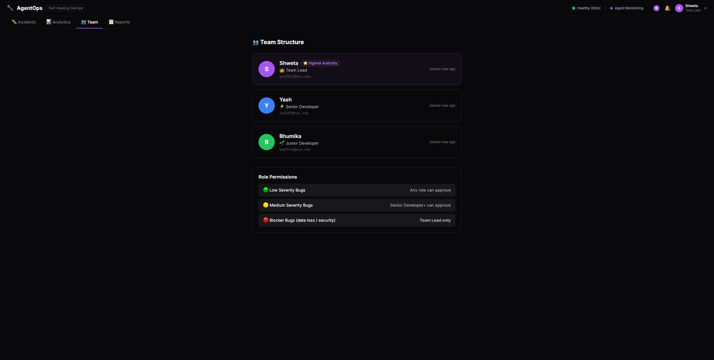

# 🔧 AgentOps — Self-Healing DevOps Agent

> **AI-powered incident detection, diagnosis, and auto-fix with collaborative human-in-the-loop.**

AgentOps monitors a live production e-commerce application, detects failures in real time, uses Claude AI to diagnose root causes and generate fixes, validates safety through White Circle AI, and auto-deploys fixes when confidence is high — or escalates to the team for approval when the risk is too great.

Built in 5 hours at the **Iterate x CBS AI Club Hackathon** at Columbia Business School.


---

## 🌐 Live Demo

> **Deployed and running — try it now!**

| Link | Description |
|---|---|
| [**🖥️ Dashboard**](https://her-believe-page-bean.trycloudflare.com) | Main AgentOps dashboard — login, inject faults, watch AI auto-heal |
| [**🛒 Shop**](https://her-believe-page-bean.trycloudflare.com/shop) | E-commerce storefront — browse products, add to cart, checkout |
| [**📡 Live API**](https://her-believe-page-bean.trycloudflare.com/live) | Real-time API viewer — products, orders, analytics, users (auto-refreshes) |

**Team Logins:** Bhumika (`bds9746@nyu.edu`) · Yash (`yp2693@nyu.edu`) · Shweta (`ss19623@nyu.edu`) — password: `1234`

---

## 📸 Screenshots

### Dashboard — Real-Time Incident Timeline
Configuration error detected as **BLOCKER** at 95% confidence. Claude AI identifies the exact root cause, generates a targeted fix with diff, and White Circle AI validates safety — all in under 15 seconds.



### Auto-Fix in Action
Bug injected → Claude diagnoses a NameError at handler.py line 54 → White Circle validates the fix → auto-deployed at 95% confidence without human intervention. Full timeline from detection to resolution.



### Live API Viewer
Real-time view of the e-commerce app running inside the Blaxel sandbox. Products, orders, analytics, and users — all live. Status indicator shows current health + active incidents.



### E-Commerce Shop
Full storefront with product catalog, cart management, and checkout — orders flow through to the live API in real time.



### Blaxel Sandbox
The target e-commerce app runs inside a real Blaxel persistent sandbox (`agentops-ecom`). 373+ API calls, 0% error rate, 7% resource usage.



### Analytics & Team
Track resolution rates, auto-fix performance, severity breakdown, and team activity. Role-based permissions matrix shows who can approve what.

<p float="left">
  
  
</p>

---

## 🎯 The Problem

Production incidents are stressful, time-consuming, and often happen at the worst times. Engineers scramble to diagnose issues, worry about making things worse with a fix, and lack visibility into what's happening across the team. Traditional monitoring tools alert you — but they don't *fix* anything.

## 💡 Our Solution

AgentOps is a **self-healing DevOps agent** that:
1. **Detects** failures via continuous health monitoring (every 5s)
2. **Diagnoses** root causes using Claude AI with full traceback analysis
3. **Generates** targeted fixes with code diffs and GitHub deep links
4. **Validates** fix safety through White Circle AI guardrails
5. **Auto-deploys** when confidence > 85% and severity is non-critical
6. **Escalates** to the team with role-based approval for critical/blocker issues
7. **Learns** from human decisions to improve future confidence scoring

All of this happens on a **real running application** in a **real Blaxel sandbox** — not a simulation.

---

## 🏗️ Architecture

```
┌─────────────────┐     ┌──────────────────┐     ┌───────────────┐
│  E-Commerce App  │────▶│  AgentOps Server  │────▶│   Claude AI   │
│  (Blaxel Sandbox)│     │  (FastAPI + WS)   │     │  (Diagnosis)  │
│  Port 3000       │     │  Port 8000        │     │               │
└─────────────────┘     └────────┬───────────┘     └───────┬───────┘
                                 │                          │
                    ┌────────────▼──────────┐    ┌─────────▼────────┐
                    │  WebSocket Dashboard  │    │  White Circle AI  │
                    │  Real-time updates    │    │  Safety Validation│
                    │  Role-based auth      │    │  Policy Engine    │
                    └───────────────────────┘    └──────────────────┘
                                 │
                    ┌────────────▼──────────┐
                    │    ElevenLabs TTS     │
                    │    Voice Alerts       │
                    └───────────────────────┘
```

### How It Works

1. **Health Monitor** polls the target app every 5 seconds via the Blaxel sandbox
2. On failure, the **Agent Core** captures error logs, tracebacks, and source code context
3. **Claude AI** analyzes everything and returns: root cause, affected file + line, fix diff, confidence score, and plain-English explanation
4. **White Circle AI** validates the proposed fix against safety policies (no destructive commands, no credential exposure, no data loss)
5. Based on confidence + severity, the agent either **auto-deploys** or **escalates** to the team via WebSocket
6. Team members approve/reject through the dashboard with **role-based permissions**
7. The **Learning System** records every decision to adjust future confidence scores

### Confidence-Based Escalation

| Confidence | Severity | Action |
|---|---|---|
| **≥ 85%** | Medium/Low | 🤖 **Auto-fix** — deployed without human approval |
| **≥ 85%** | Blocker | 🔒 **Team Lead approval required** — too risky for auto |
| **50-85%** | Any | 👥 **Human review** — team decides |
| **< 50%** | Any | ⚠️ **Escalate** — needs expert investigation |

### Confidence Scoring

```
Base (0.50)
  + Error category match     (+0.10)
  + File identified           (+0.05)
  + Line number found         (+0.05)
  + Sandbox test passed       (+0.15)
  + Fix applied successfully  (+0.05)
  + Safety check passed       (+0.10)
  + Safety score bonus        (+0.10)
  + Claude AI reasoning       (+0.15)  ← LLM trust boost
  + Learning adjustment       (±0.20)  ← from past human decisions
  − Severity penalty          (varies)
```

---

## 🛠️ Sponsor Integrations

### 🧊 Blaxel — Sandboxed Runtime
- Target e-commerce app runs inside a **Blaxel persistent sandbox** (`agentops-ecom`)
- All file operations (read/write handler.py, config.json) go through Blaxel SDK
- Process management (start/stop/kill) via Blaxel process API
- Isolated code testing sandbox for validating fixes before deployment
- **373+ API calls** processed with **0% error rate**

### 🧠 Anthropic Claude — AI Reasoning
- **Root cause diagnosis**: Analyzes health check errors, tracebacks, and source code
- **Fix generation**: Produces targeted code diffs with file + line identification
- **Confidence scoring**: Claude-diagnosed issues get a **+15% trust boost** over rule-based fallback
- Model: `claude-sonnet-4-20250514` with structured JSON output
- Graceful fallback: Rich rule-based engine works when API is unavailable

### 🛡️ White Circle AI — Safety Validation
- Every proposed fix passes through White Circle's guardrail API before deployment
- Endpoint: `POST /api/session/check` with deployment-specific policies
- Custom policy: **AgentOps Safety Guard** — flags destructive commands, credential exposure, data loss, security regressions
- Allows: process restarts, file restores from backup, config rollbacks
- Double verification enabled for production safety

### 🔊 ElevenLabs — Voice Alerts
- Critical/high severity incidents trigger voice alerts via ElevenLabs TTS
- Model: `eleven_flash_v2_5` for low-latency alerts
- Audio delivered via WebSocket to all connected dashboard users
- Alert script includes: incident title, severity, root cause summary, proposed fix

---

## 🎮 Features

### Real Fault Injection (Not Simulated!)
| Fault Type | What It Does | Severity | Auto-Fix? |
|---|---|---|---|
| **💥 Crash** | Kills the app process (OOM simulation) | 🔴 BLOCKER | ❌ Team Lead only |
| **⚙️ Bad Config** | Corrupts config.json with invalid JSON | 🔴 BLOCKER | ❌ Team Lead only |
| **🐛 Bug** | Injects NameError in handler.py | 🟡 MEDIUM | ✅ When confidence ≥ 85% |
| **🐌 Slow** | Adds time.sleep(10) to handler.py | 🟡 MEDIUM | ✅ When confidence ≥ 85% |

### Role-Based Team Authentication
| Role | User | Can Approve | Permissions |
|---|---|---|---|
| **Team Lead** ⭐ | Shweta | All bugs (including BLOCKER) | Full access, clearance reports, assign bugs |
| **Senior Dev** ⚡ | Yash | Medium + Low severity | Approve medium bugs, assign tasks |
| **Junior Dev** 🚀 | Bhumika | Low severity only | View incidents, limited approval |

### Dashboard Tabs
- **🔥 Incidents**: Real-time incident timeline with animated detection → diagnosis → fix → deploy flow
- **📊 Analytics**: Resolution rate, auto-fix rate, avg resolution time, severity breakdown, team performance
- **👥 Team**: Member profiles, role badges, permissions matrix
- **📋 Reports**: Clearance reports (auto-generated on resolution, sent to team lead)

### Additional Features
- **🔗 GitHub Deep Links**: Every fix links to the exact file and line in the repo
- **📖 Human-Readable Explanations**: Plain English explanations with analogies (restaurant kitchen, recipe typo, traffic jam) for non-technical stakeholders
- **💥 Impact Analysis**: Automated blast radius assessment for each fault type
- **🔔 Notification System**: Bell badge with unread count, clearance reports auto-sent to team lead
- **🧠 Learning System**: Records human approve/reject decisions to adjust future confidence
- **🛒 E-Commerce Shop**: Full storefront with cart, checkout, live order tracking
- **📡 Live API Viewer**: Real-time view of all API endpoints with auto-refresh every 5s
- **🎤 Voice Alerts**: ElevenLabs TTS for critical incidents

---

## 🧪 Demo Flow

```
1. Login as Shweta (Team Lead)
         ↓
2. Inject Bug → NameError in handler.py
         ↓
3. Agent detects failure in ~5 seconds
         ↓
4. Claude AI diagnoses → identifies handler.py:54, generates fix diff
         ↓
5. White Circle AI validates → "✅ SAFE — no policies flagged"
         ↓
6. Auto-deploys at 95% confidence (MEDIUM severity → no human needed)
         ↓
7. App recovers → healthy in ~30 seconds
         ↓
8. Inject Crash → process killed (BLOCKER severity)
         ↓
9. Agent diagnoses → 90% confidence, but BLOCKER → needs Team Lead
         ↓
10. Login as Bhumika → try to approve → "❌ Insufficient clearance"
         ↓
11. Login as Shweta → approve → fix deploys → clearance report generated
         ↓
12. Browse Shop → Cart → Checkout → Watch order appear in Live API view
```

---

## 🚀 Quick Start

### Prerequisites
- Python 3.10+
- Blaxel account + API key
- Anthropic API key (optional — rule-based fallback works without it)
- White Circle AI API key + deployment ID
- ElevenLabs API key (optional — for voice alerts)

### Setup
```bash
# Clone
git clone https://github.com/prasad-yashdeep/agentops.git
cd agentops

# Virtual environment
python3 -m venv venv
source venv/bin/activate
pip install -r requirements.txt

# Configure
cp .env.example .env
# Edit .env with your API keys

# Run
python3 main.py
```

### Environment Variables
```env
# Blaxel — Sandboxed Runtime
BL_API_KEY=your_blaxel_key
BL_WORKSPACE=your_workspace

# Anthropic — AI Reasoning
ANTHROPIC_API_KEY=sk-ant-api03-...

# White Circle AI — Safety Validation
WHITECIRCLE_API_KEY=wc-...
WHITECIRCLE_API_URL=https://us.whitecircle.ai/api
WHITECIRCLE_DEPLOYMENT_ID=your_deployment_id

# ElevenLabs — Voice Alerts
ELEVENLABS_API_KEY=sk_...
ELEVENLABS_VOICE_ID=21m00Tcm4TlvDq8ikWAM
```

### Access
- **Dashboard**: https://her-believe-page-bean.trycloudflare.com
- **Live App**: https://her-believe-page-bean.trycloudflare.com/live
- **Shop**: https://her-believe-page-bean.trycloudflare.com/shop
- **Team Logins**: Bhumika / Yash / Shweta (password: `1234`)

---

## 📁 Project Structure

```
agentops/
├── main.py              # FastAPI server, auth, proxy, analytics, WebSocket
├── agent_core.py        # Agent brain: monitoring, diagnosis, fix generation, confidence
├── monitored_app.py     # Blaxel SDK integration, fault injection, health checks
├── safety_check.py      # White Circle AI integration + local safety engine fallback
├── voice_alerts.py      # ElevenLabs TTS voice alert generation
├── sandbox.py           # Blaxel sandbox for isolated code testing
├── db.py                # SQLite models: User, Incident, Notification, LearningRecord
├── schemas.py           # Pydantic schemas
├── config.py            # Environment variable loading
├── static/
│   ├── index.html       # Dashboard: login, incidents, analytics, team, reports
│   ├── app.js           # Frontend: WebSocket, auth, tabs, role-based UI
│   ├── live.html        # Live API viewer (auto-refresh 5s)
│   └── shop.html        # E-commerce storefront with checkout
├── target_app/
│   ├── server.py        # Target e-commerce HTTP server
│   ├── handler.py       # Request handler (products, orders, analytics, users)
│   ├── handler.py.bak   # Known-good backup for fault recovery
│   ├── config.json      # App configuration
│   └── config.json.bak  # Known-good config backup
└── docs/
    └── images/          # Screenshots for README
```

---

## 👥 Team

- **Yash Prasad** — Architecture, agent core, full-stack development
- **Shweta** — Testing, role-based access design, demo flow
- **Bhumika** — UI/UX, team collaboration features

---

## 📄 License

MIT
